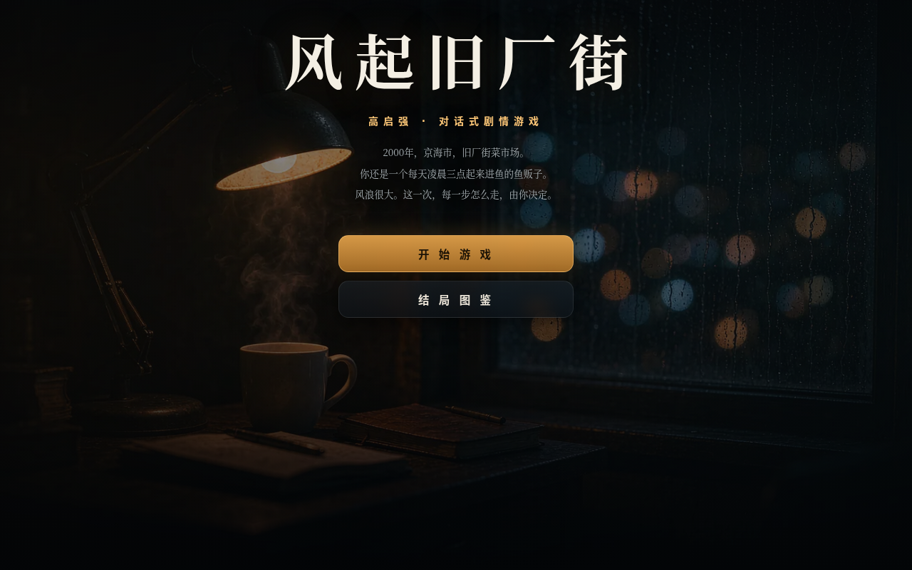
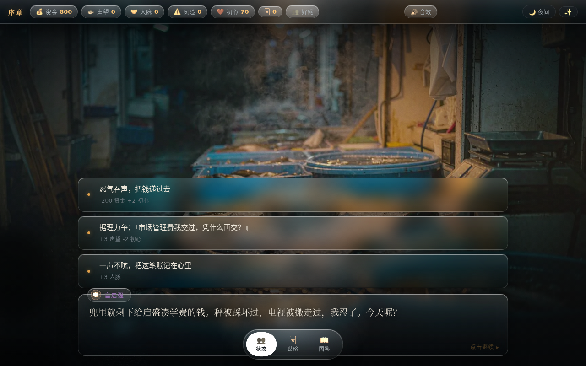
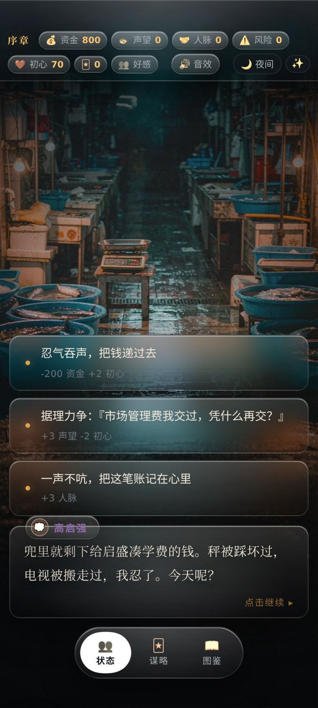
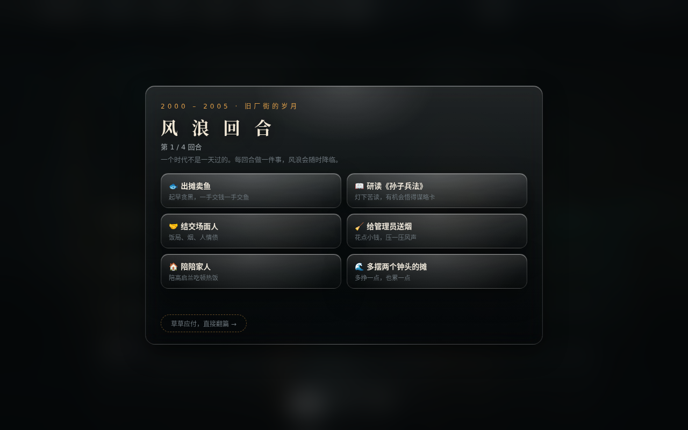
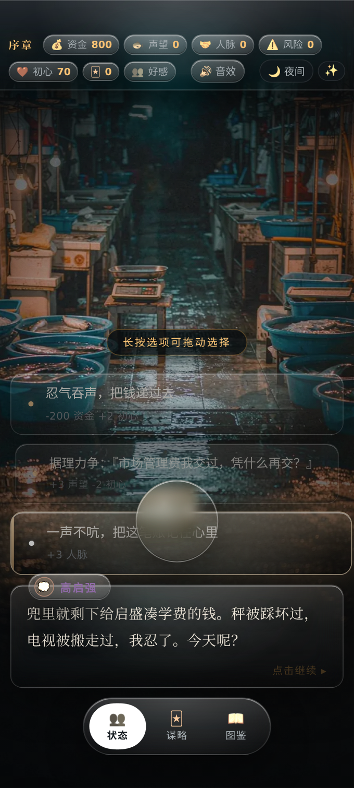
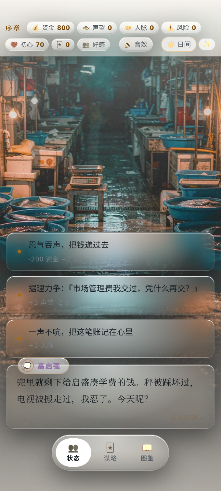
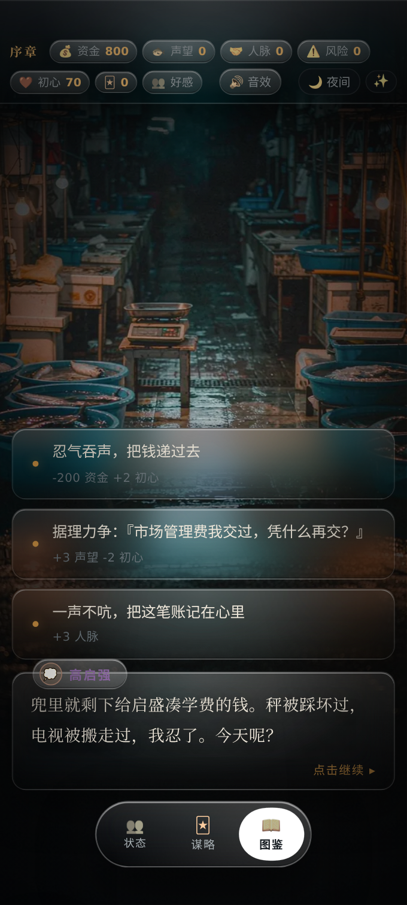
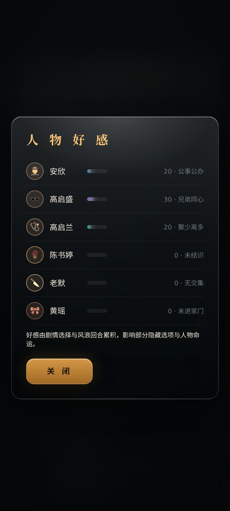
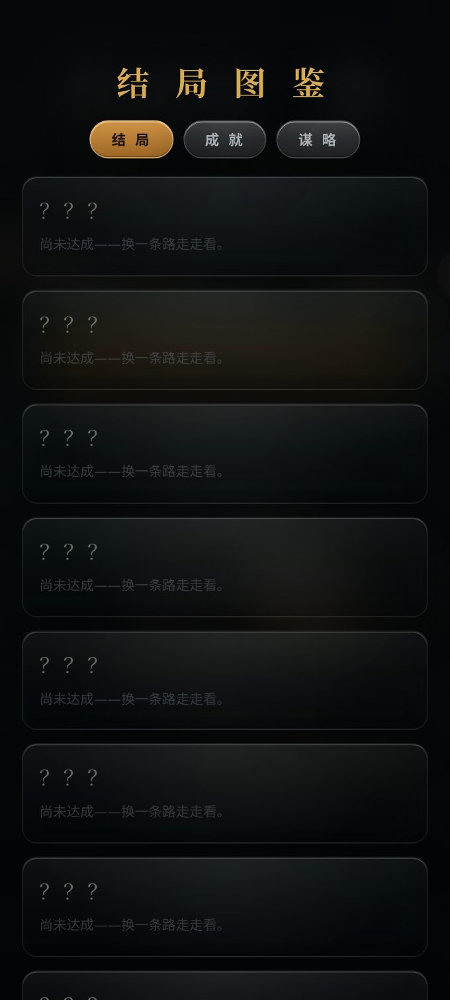
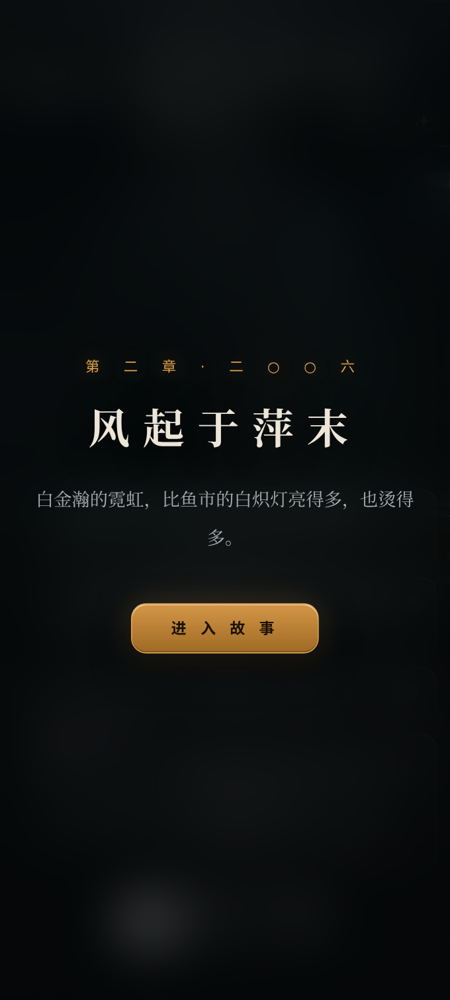

# 🎣 风起旧厂街 · 高启强

> 2000 年，京海市，旧厂街菜市场。你还是一个每天凌晨三点起来进鱼的鱼贩子。
> **四端发布：网页 / Windows / Android APK / Android PWA** · 9 结局 · 13 成就 · 照片级写实场景
>
> 🌐 在线试玩：<https://uahz.github.io/JcJgame/> · ⬇️ 下载：<https://github.com/uahz/JcJgame/releases/latest>



## 🧊 V2.7 · 修掉你报的每一个问题

| 你报的问题 | 真正的根因 | 修法 |
|---|---|---|
| 点「图鉴」显示不完全 / 整页空白 | `onclick=showGallery` 直传，浏览器把 **click 事件对象**当成了 tab 参数 | 改 `()=>showGallery("end")` + tab 白名单收敛 |
| 顶部状态栏没显示、一条大黑边 | 安全区注入**单位错误**：`getSystemWindowInsetTop()` 是物理像素，被当 CSS px 用，顶栏被撑高 dpr 倍 | 按 density 换算后再注入 `--sat/--sab`；同时保留状态栏 + 透明背景 + 关掉 Android 10+ 的对比度蒙版 |
| 返回键直接退出到桌面 | 顶层 `let st` 不在 `window` 上，底栏与返回键按 `window.st` 判断"是否在局中"，判断恒为 false | `Object.defineProperty` 把 `st` 桥接到 window（读写同一变量）；返回键三级：关界面 → 强流程不退 → 「再按一次退出」 |
| 局内（图鉴里）按返回回到了桌面 | 同上；且图鉴没有"从哪来回哪去"的概念 | 新增 `closeGallery()` + `galFrom` 记录来源，关掉回标题页 / 结局页 / 局内 |
| 底栏「状态 / 谋略」点了没反应 | 同上一条（`window.st` 恒 undefined，直接静默 return） | 桥接后正常打开；不在局中时明确 toast「开局后才能看…」而不是装死 |
| 仿苹果液态玻璃没有 | 低特效档判定过宽：`cores<=4` 把大量中端机当成弱机，玻璃整体降级成实心色块 | 收紧为 `c<=2 \|\| (c<=4 && m<=2)`，并新增 HUD **✨ 手动特效开关**（选择持久化） |
| 底栏动效没设计好 | 拖动时只有 hot 项反色，原选中项还是深底深字，看不清 | `#nav.sliding .navbtn.active:not(.hot)` 让原选中项让位成浅色；蒙版去掉多余模糊只留暗角 |
| 日间模式下顶栏还是深色横带 | 日间主题漏盖 `#hud` | 补 `html[data-theme="day"] #hud` 亮色渐变 |

版本 2.7（versionCode 28），其余视觉与玩法与 v2.6 一致。

## 🧊 V2.6 · 仿苹果液态玻璃 + 沉浸式状态栏

- **真折射液态玻璃**：不是「模糊一下就说是玻璃」。做法是先生成一张**径向透镜法线贴图**（折射强度编码进 RG 通道，中心不偏折、峰值约在半径 0.78、边缘平滑收回），再用 `feDisplacementMap` 做位移 —— 于是玻璃背后的画面会像透过一块厚玻璃那样被真实弯折。加镜面边缘高光与跟随指针的反光斑。
- **底栏液态透镜**：选中项背后是一枚会滑动的玻璃透镜（弹性缓动 + 液态融合）；**按住底栏可横滑连续切换**，滑动时整页压一层蒙版提示「正在切换界面」。
- **拖拽玻璃透镜**：长按选项后出现一枚跟随指针的玻璃透镜，被拖过的目标项实时高亮。
- **日间 / 夜间双模**：HUD 一键切换并记住选择。日间不是反色，而是亮玻璃 + 深字并降低照片压暗；状态栏图标明暗随主题自动切换。
- **沉浸式状态栏**：保留状态栏、背景透明、内容铺到栏下，并显式关掉 Android 10+ 给透明状态栏垫的对比度蒙版。
- **返回键三级处理**：先关界面（图鉴/面板/结局），风浪回合与时代过场不关也不退，无处可退才提示「再按一次退出」。

## 🎬 写实电影感（v2.5 引入）

v2.5 把整套视觉从「吉卜力奶油色」换成**暗夜电影感**：低照度写真背景、暖琥珀实用光与冷青阴影对撞、浅景深、胶片颗粒、湿面反光，配合暗夜玻璃拟态面板与暖金强调色。三端共用同一套视觉语言。

| 网页 / Windows | Android（APK / PWA） |
|---|---|
|  |  |

## ⬇️ 下载

### 📱 Android APK（推荐）
**[下载 风起旧厂街-v2.7.apk](https://github.com/uahz/JcJgame/releases/latest)** —— 约 0.8 MB，传到手机点击安装即玩
> 包名 `com.uahz.fengqi` · 版本 2.7（versionCode 28）· 最低 Android 5.0 · 竖屏 · 已签名（debug 证书）
>
> ⚠️ **从 v2.6 及更早版本升级，需先卸载旧版再装**：旧包用的是另一份 debug 证书（只存在于原开发机），
> 本次重建无法复用，签名不同系统会拒绝覆盖安装。卸载后装 v2.7 即可（旧存档会一并清空）。
> 想保留覆盖安装能力，请把 `05-Android源码工程/keystore/` 换成你自己的正式签名。
>
> v2.7 同时修掉了：图鉴打不开、状态栏黑边、返回键退出桌面、底栏点不动、液态玻璃消失等问题——详见文首对照表。

### 🖥 Windows 桌面版
**[下载 FengqiJiuchangjie.exe](https://github.com/uahz/JcJgame/releases/latest)** —— 约 16 MB，免安装双击即玩
> 需 Windows 10/11（系统自带 WebView2）。存档位于 `%APPDATA%\FengqiJiuchangjie`。

### 🌐 在线试玩（无需下载）
- **网页版（写实电影感）**：[点击即玩](https://uahz.github.io/JcJgame/fengqi-jiuchangjie.html)
- **安卓版 PWA**：[点击进入](https://uahz.github.io/JcJgame/mobile/)，安卓 Chrome 菜单「添加到主屏幕」即作为独立 App 安装，支持离线

## 🎨 三套 UI → 一套写实电影感

v2.5 起三端视觉统一（原先网页是吉卜力、安卓是液态玻璃）：

| 端 | 说明 |
|---|---|
| 网页 / Windows | 横版构图（背景 1440w），暗夜玻璃面板 + 暖琥珀光 |
| Android APK / PWA | 竖版构图（背景 880w），同一套视觉语言 + 底部悬浮导航 |

**场景**：旧厂街鱼市 / 派出所走廊 / 白金瀚 / 大厦顶层 / 雨夜街道 / 审讯室 / 晨光天台 —— 7 张照片级写实背景，随地点切换淡入，并叠加胶片颗粒、暗角与电影调色。

**图标**：暗底暖金鲤鱼（旧厂街鱼摊意象），三端统一；小到 32px 仍清晰可辨。

## 🎮 玩法（V2）

- **对话驱动**：40+ 剧情节点，四个时代（2000 旧厂街 → 2006 风起 → 2015 登顶 → 2021 潮退），打字机台词，点击/空格推进
- **五维属性**：💰资金 🐟声望 🤝人脉 ⚠️风险 ❤️初心；每个选项自带数值预览，部分选项需人脉达标或持有关键印记
- **🌊 风浪回合**：章节之间的经营层——每时代 4 回合（卖鱼/读书/结交/打点/陪家人/拓张），45% 概率降临随机风浪事件（共 18 种）
- **🃏 谋略卡**：研读《孙子兵法》习得六张卡（瞒天过海/借刀杀人/反客为主/金蝉脱壳/以逸待劳/远交近攻），在六个关键剧情打出隐藏选项
- **👥 人物好感**：安欣/启盛/启兰/大嫂/老默/黄瑶六人好感面板，≥70 解锁专属隐藏选项
- **🏆 成就系统**：13 枚成就 · **9 种结局** · S/A/B/C 评级 · 三页图鉴（结局 / 成就 / 谋略）
- **📱 全平台长按拖拽**：**长按选项约 0.17 秒进入拖拽选择**（Apple 式手感：拖动时目标项高亮、触感反馈、松手即选中）——三端通用，不再限于安卓




## 📱 安卓专属优化

| 长按拖拽选择 | 日间模式 | 底栏滑动切换 |
|---|---|---|
|  |  |  |

| 人物好感 | 结局图鉴 | 时代过场 |
|---|---|---|
|  |  |  |

- **底部悬浮导航**：状态 / 谋略 / 图鉴，选中项带液态玻璃透镜，**按住可横滑连续切换**，手机拇指可达
- **沉浸式状态栏**：保留状态栏 + 透明背景 + 内容铺到栏下；显式关闭 Android 10+ 的 `setStatusBarContrastEnforced`，否则透明状态栏会被垫出一条黑边
- **返回键三级处理**：先关界面 → 强流程不关也不退 → 无处可退时「再按一次退出」，不再一按就掉出游戏
- **关闭系统强制暗色**（`setAlgorithmicDarkeningAllowed(false)` / `FORCE_DARK_OFF`）——否则 Android 10+ 会自动反色页面，把写实照片的调色毁掉
- **背景改为独立 WebP 文件**按需加载，页面体积 1020 KB → 121 KB；APK 1065 KB → 813 KB
- **开启 `setOffscreenPreRaster`** 预栅格化，滑动更稳
- **弱机自动低特效档**：仅 `硬件线程 ≤ 2`，或 `≤ 4 线程且内存 ≤ 2GB` 才降级（v2.7 收紧，中端机不再误伤）；HUD ✨ 键可随时手动切换，选择会被记住
- **安全区适配**：原生层把状态栏 / 导航条高度注入 CSS 变量 `--sat` / `--sab`，顶栏不被刘海遮挡

## 🎬 题材说明

基于电视剧《狂飙》前期故事的同人演绎，角色与事件均为艺术再创作；暴力情节全部侧写处理，结局传达「法网恢恢、回头是岸」。

## 🛠️ 技术

- 纯原生 **HTML/CSS/JS 单文件**（网页版），零外部依赖、零构建、离线可玩
- 三端由**同一份母版**构建：`theme.css`（样式）+ 原游戏逻辑，经构建脚本产出网页版（背景 base64 内联，横版 1440w）与 PWA / APK（背景独立 WebP，竖版 880w）
- **WebAudio** 实时合成全部音效（打字滴答 / 选择确认 / 风险告警 / 过场三连音），可一键静音
- **写实背景**为 WebP（质量 78），7 场景 × 2 构图；颗粒层用 `transform` 动画走合成层，不触发重绘
- **Android APK**：原生 WebView 外壳（`05-Android源码工程/`），免 Gradle 构建链（aapt2 → javac → d8 → zipalign → apksigner），DOM Storage 持久化存档
- **Windows 桌面版**：pywebview + PyInstaller onefile；页面经本地 HTTP 服务承载以保证 `localStorage` 可用（`about:blank` 下存档会失效）
- `localStorage` 自动存档（受限上下文安全降级）+ 图鉴 / 成就 / 谋略进度持久化

## ✅ 质量验证

- 内置 `window.__qa(n)` 剧情图自检：静态校验全部节点引用 + n 局随机选择模拟通关（含风浪回合）
- **实测 600 局 × 3 端（网页 / PWA / APK 资源）100% 到达结局、0 错误**
- **v2.7 功能断言 56 项全通过**（真机视口 412×915 + 真实指针事件，直接从 APK 里解出 assets 跑）：图鉴从标题页打开完整可滚、三个标签切换、返回键图层级（标题页 / 局内都不掉出游戏）、底栏三键功能与高亮同步、长按横滑的滑动态/蒙版/hot 跟随/松手切换、拖动中活动标签可读性、日间与夜间切换及持久化、低特效档与液态玻璃恢复、三键导航机型安全区、剧情自检
- **长按拖拽 7 项真机模拟测试全通过**（Playwright 驱动 Edge，iPhone 视口 390×844）：长按进入拖拽态 / 高亮跟随 / 松手即选中并推进剧情 / 普通点按不被吞掉 / 短按上滑不误触发
- APK 经 `apksigner verify` 校验（v1+v2+v3 签名方案全部通过）+ `aapt2 dump badging` 清单校验
- 桌面版 `--selftest` 验证引擎加载与 localStorage 可用性
- 三端全界面截图实测（`07-截图/`），含 1920 宽桌面与 360 小屏手机的极端视口核对

设计文档见 [fengqi-jiuchangjie-design.md](06-文档/fengqi-jiuchangjie-design.md)。

## 📁 结构

```
01-网页版（写实电影感）/       # 单文件 HTML（背景 base64 内联，横版），双击即玩
02-安卓版PWA（写实电影感）/    # PWA：index.html + manifest + SW + img/*.webp + 图标
03-Android安装包/             # 风起旧厂街-v2.7.apk
04-Windows桌面版/             # FengqiJiuchangjie.exe（与「风起旧厂街.exe」同一文件）
05-Android源码工程/            # MainActivity.java + Manifest + res + assets + 构建脚本 + keystore/
06-文档/                      # README + 设计文档 + v2.7 进度与待办
07-截图/                      # 三端界面截图 20 张（含日间模式 / 底栏滑动 / 图鉴）
index.html / mobile/          # GitHub Pages 入口：入口页 → 网页版 / PWA 直链
```

## 🛠️ 从源码构建

**Android APK**（需 JDK 17 + Android SDK build-tools 34 / platform 34，Windows）
```bat
05-Android源码工程\build_apk.bat
```
依次执行 aapt2 → javac → jar/d8 → 组装 → zipalign → apksigner，产物落在 `03-Android安装包/`。

> 注：`aapt2` / `apksigner` / `javac` 不支持非 ASCII 路径，构建脚本会自动把工程暂存到纯英文临时目录再打包。
> 签名：`05-Android源码工程/keystore/fengqi-debug.keystore`（口令 `android`，别名 `androiddebugkey`）。
> 以后每次出包都用它，即可保持"新包覆盖旧包"的能力；换正式签名同理，换一次之后别再换。

## License

[MIT](LICENSE)
